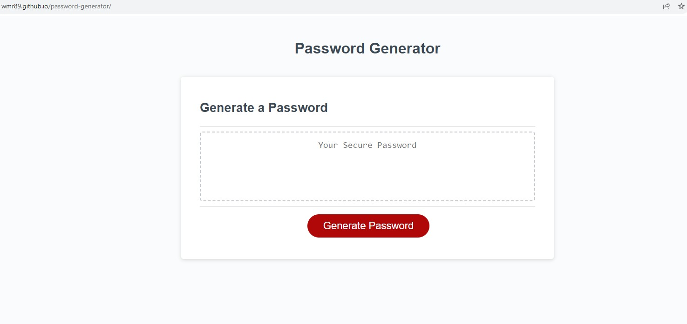
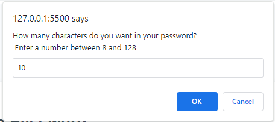
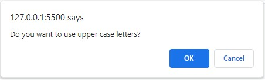
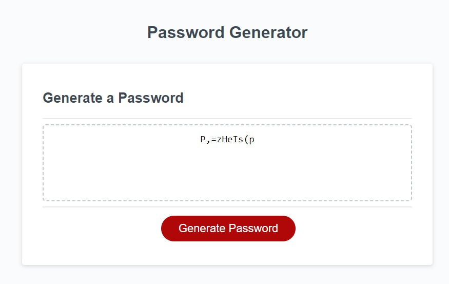

# <Password Generator>

## Description

This project modifies a starter code and adds javaScript to create a password generator. The password generator can be used to create passwords between 8 and 128 characters with the option to add lowercase letters, uppercase letters, numbers, and special characters.

## Usage

1) Navigate to [the password generator](https://wmr89.github.io/password-generator/)

2) Click the generate button.

3) Specify the number of charcters wanted in the password.

4) When prompted, Select "ok" for each set of characters wanted in the password. Select "cancel" if the type of character is not wanted. You must select "ok" for at least one set of characters.

5) The password will be generated in the text box.

## Credits

Stater code from https://github.com/coding-boot-camp/friendly-parakeet

## License

See LICENSE in the REPO

---